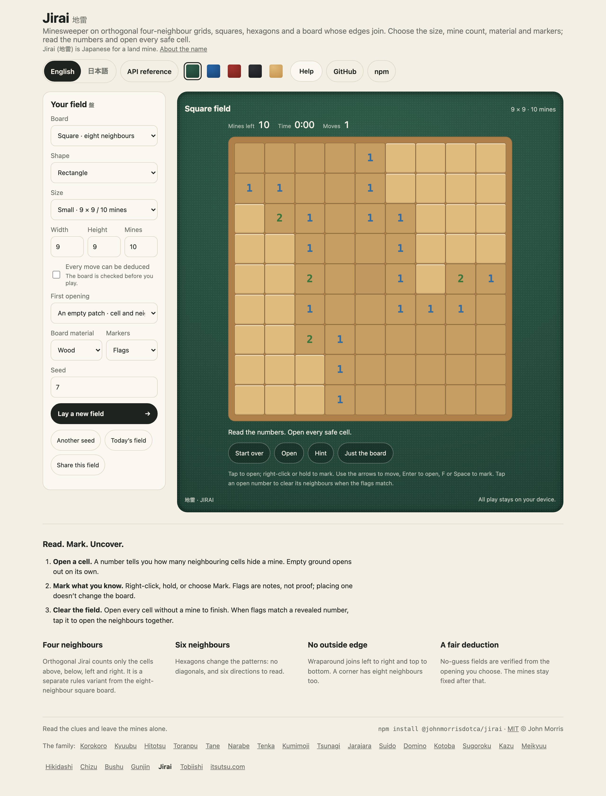
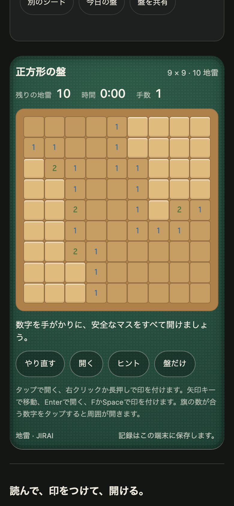

<h1 align="center">Jirai <sub>地雷</sub></h1>

<p align="center"><strong>Every number is a clue.</strong><br>
Minesweeper across four-neighbour, eight-neighbour, hexagonal and wraparound grids. Choose a shape, lay a seeded field, and clear it with deductions you can trust.</p>

<p align="center">
  <a href="https://github.com/johnmorrisdotca/jirai/actions/workflows/ci.yml"></a>
  <a href="https://www.npmjs.com/package/@johnmorrisdotca/jirai"></a>
  <a href="./LICENSE"></a>
  
  
</p>

<p align="center"><a href="https://johnmorrisdotca.github.io/jirai/"><strong>Play Jirai →</strong></a> · <a href="https://johnmorrisdotca.github.io/jirai/api.html">API reference</a></p>

<p align="center">
  
  
</p>

Jirai is a Minesweeper rules engine and player for TypeScript and JavaScript. The core is plain functions; drawing, browser controls, a custom element and an optional React wrapper are separate imports. The package has no runtime dependencies and needs Node 22 or a modern browser.

## In 30 seconds

```sh
npm install @johnmorrisdotca/jirai
```

```ts
import { DEFAULT_SETTINGS, hintFor, newGame, play, visibleGame } from "@johnmorrisdotca/jirai";

let game = newGame({ ...DEFAULT_SETTINGS, width: 9, height: 9, mines: 10, seed: 42 });
game = play(game, { kind: "reveal", cell: 40 }); // the first reveal deals the seeded board
const hint = hintFor(visibleGame(game));          // certain safe cells/mines from clues only
```

For a dedicated four-neighbour variant, its entry fixes the topology for you:

```ts
import { makeOrthogonalBoard, newOrthogonalGame } from "@johnmorrisdotca/jirai/orthogonal";

const settings = { width: 9, height: 9, mines: 10, noGuess: true, opening: "clear", seed: 42 };
const game = newOrthogonalGame(settings);
const board = makeOrthogonalBoard(settings, 40); // counts only edge-sharing neighbours
```

## Who it is for

- **Puzzle and game sites** that want Minesweeper with boards a player can trust: seeded fields that deal the same everywhere, a safe opening, verified no-guess deals, and the words in English and Japanese.
- **Developers of other front ends** who want the rules, the dealer and the deduction solver as plain functions, with no DOM, and their own drawing on top.
- **Players and teachers** who want to learn why a cell is safe: the hints explain the deduction that proves it, and a level steps up a measured difficulty.

## Features

- **Four rule sets:** square grids count eight neighbours, orthogonal grids count four, hex grids count six axial neighbours, and wraparound grids join opposite square edges.
- **Board outlines:** rectangles, hearts, stars and hexagon outlines. Shaped boards have cut-outs; wraparound works with rectangles.
- **A fair first move:** choose a safe first cell or a clear opening with all its neighbours safe.
- **Four levels:** easy (9×9, 10 mines), medium (16×16, 40), hard (30×16, 99) and extra-hard (40×24, 240), on every rule and outline. The old names `beginner`, `intermediate` and `expert` still work and mean easy, medium and hard.
- **Verified no-guess deals:** optional deduction-only dealing accepts a board only when the solver proves every safe cell from the opening, even at extra-hard's 25% mines. It throws `GenerationError` when the bounded search cannot prove one.
- **Fixed seeded fields:** after the opening, mines never move. A seed and settings reproduce the same deal.
- **Familiar play:** reveal, flag, question-mark, chord, flood-open, explained hint, timer, undo by saved replay, and a just-the-board dialog.
- **Accessible controls:** keyboard navigation, pointer and touch, long press to mark, English and Japanese strings, and board labels read by assistive technology.
- **Materials and markers:** ivory, wood or slate; flags, stones or flowers. Host CSS can replace the palette.

## Use it in your project

Mount a player into any element. The first reveal asks the module worker to deal the board, so serve the package over HTTP and allow same-origin module workers in your content security policy.

```ts
import { DEFAULT_SETTINGS, mountJirai } from "@johnmorrisdotca/jirai/play";

const board = mountJirai(document.querySelector<HTMLElement>("#game")!, {
  settings: { ...DEFAULT_SETTINGS, grid: "orthogonal", seed: 7 },
  material: "wood",
  pieces: "stones",
  language: "en",
  onChange(game) { localStorage.setItem("jirai", board.progress()); },
  onFinish(game) { console.log(game.status, game.helped); },
  onError(error) { console.error(error); },
});
board.set({ material: "slate", language: "ja" });
board.restart();
board.destroy();
```

The handle also provides `game()`, `progress()`, `play(cell, mark?)`, `hint()`, and `load(settings, progress?)`. Set `controls: false` when your page supplies its own controls and status. Change options with `set`; call `destroy` when the host is removed.

Use the custom element without a mount call:

```html
<script type="module">
  import "@johnmorrisdotca/jirai/element/define";
</script>
<jirai-board width="9" height="9" mines="10" seed="42"
  grid="orthogonal" opening="clear" no-guess="true"
  material="wood" pieces="stones" lang="ja"></jirai-board>
```

The optional React entry exports `JiraiBoard` from `@johnmorrisdotca/jirai/react`; React is an optional peer dependency. Its options are read when mounted. Use a new React `key` to start with a different settings object.

## Rules and settings

| Setting | Values and limits |
| --- | --- |
| `grid` | `square` (eight neighbours), `orthogonal` (four), `hex` (six), or `wrap` (eight; opposite edges join). |
| `shape` | `rectangle`, `heart`, `star` or `hexagon`; non-rectangles require at least 9 rows and columns. Wraparound requires `rectangle`. |
| `width`, `height` | 3–60 each, with at most 2,400 total cells. |
| `mines` | At least one, fewer than active cells, and low enough to leave the selected opening. |
| `noGuess` | If true, reject any deal the bounded deduction solver cannot finish from the opening. This proves the deal under this solver’s deductions, not a unique solution to every custom board. |
| `opening` | `safe` protects the first cell; `clear` also protects its neighbours. |
| `seed` | Integer from 0 through 4,294,967,295. A seed is interpreted together with all other settings and the first cell. |
| `material`, `pieces`, `language` | `ivory`, `wood`, `slate`; `flags`, `stones`, `flowers`; `en`, `ja`. |

## Levels

| Level | Size | Mines | Mines per cell | Old name |
| --- | --- | --- | --- | --- |
| `easy` | 9×9 | 10 | 12% | `beginner` |
| `medium` | 16×16 | 40 | 16% | `intermediate` |
| `hard` | 30×16 | 99 | 21% | `expert` |
| `extra-hard` | 40×24 | 240 | 25% | |

`levelNamed(name)` returns the level a name means (`extra-hard` may also be written `extra hard`, `extra_hard` or `extraHard`) or `null`. `levelSettings(level, { grid, shape })` returns `{ width, height, mines }`: a rectangle gets the numbers above, and a heart, star or hexagon outline keeps the level's width and height and its share of mines over the cells that are left. `PRESETS` holds the four levels, the three old names, and `wide` (21×9, 24) and `tall` (9×21, 24).

### Huge fields

`hugeSettings(level, { grid, shape, size })` is the same four levels on a field of four times the area of the medium one: 32×32 (1,024 squares), or 48×24 or 24×48 (1,152; `HUGE_SIZES` lists them) with the level's own share of the mines, so a 32×32 has 126 mines at `easy`, 160 at `medium`, 211 at `hard` and 256 at `extra-hard`, and a heart, star or hexagon outline keeps the share over the squares it has left. They are the same fields as any other: seeded, a safe opening, and every one proved to need no guess, on all four rule sets and all four outlines (`src/huge.test.ts`, and the winning of 32×32 fields at easy and extra-hard by the explained hints alone).

Measured on a Mac (20 cores, busy): dealing and proving a 32×32 takes a median of 3 ms at easy, 5 ms at medium, 11 ms at hard and 60 ms at extra-hard (the slowest of ten seeds 73 ms; 48×24 at extra-hard 54 ms median, 91 ms slowest); the orthogonal four-neighbour field, the hardest to finish, took 46 ms median and 87 ms slowest at 25%. The player deals in a worker, so the page is never held. A reveal or a flag on the 1,024-square board is answered in 4 ms of script on the desk and about 20 ms with the processor slowed fourfold, as a phone's is, and the next frame follows at once (36 ms with 2,400 squares, the most a field may have), so the board is plain buttons still and needs no canvas. The explained `hintFor` takes 8 ms on average and at most 43 ms late in a 32×32 extra-hard field (it was 51 and 400 before 0.4.0).

```ts
import { DEFAULT_SETTINGS, hugeSettings, newGame } from "@johnmorrisdotca/jirai";

const game = newGame({ ...DEFAULT_SETTINGS, ...hugeSettings("hard"), seed: 7 }); // 32 × 32, 211 mines
```

```ts
import { DEFAULT_SETTINGS, levelSettings, newGame } from "@johnmorrisdotca/jirai";

const game = newGame({ ...DEFAULT_SETTINGS, ...levelSettings("extra-hard", { grid: "hex", shape: "star" }), grid: "hex", shape: "star", seed: 7 });
```

The levels step up a measured difficulty. `measureBoard(board)` solves a dealt board with the same deductions the hints use and reports its `density`, the share of cells proved by anything beyond one clue's count (`multiStep`), the longest chain of deductions (`depth`), the cells proved by each kind of reasoning, and a `score` (`100 × density + 100 × multiStep + depth ÷ 4`) that puts boards in order. It is not a prediction of how long a person takes. Mean score of 30 seeds, rectangles, opening in the middle:

| Rule | easy | medium | hard | extra-hard |
| --- | --- | --- | --- | --- |
| square (8 neighbours) | 26 | 41 | 63 | 85 |
| orthogonal (4) | 18 | 26 | 38 | 49 |
| hexagonal (6) | 21 | 31 | 49 | 65 |
| wraparound (8) | 25 | 41 | 67 | 96 |

Orthogonal clues carry less information, so its numbers are smaller at every level; each level is still at least a quarter harder than the one before it on every rule.

## Engine and saved games

`newGame(settings)` returns an immutable ready game with no dealt mines. `play(game, move)` returns a new state; a move that cannot be made returns the original state. `visibleGame(game)` strips hidden mine locations. `hintFor(visibleGame)` reads only opened clues: flags are marks, never evidence. `makeBoard(settings, first, options?)` deals directly, and `isSolvable(board)` independently checks whether its deduction solver can finish. The solver runs the hint engine's deductions to a fixed point in one pass, and is tested to agree with `deduce` on every board.

`gameProgress(game)` saves the settings and move history, not an unchecked answer. `gameFromProgress(code)` replays and validates the moves, returning `null` for invalid data. The original square, hex and wraparound games use version 1 records. Orthogonal games use version 2 with `variant: "orthogonal"`; `decodeOrthogonalGame` accepts only those records. Keep this distinction when storing old games.

The full engine entry is `@johnmorrisdotca/jirai`; four-neighbour helpers are in `@johnmorrisdotca/jirai/orthogonal`. Drawing is `@johnmorrisdotca/jirai/draw`, browser play is `/play`, and the custom element is `/element` or `/element/define`. The [API guide](docs/API.md) lists the entries and public calls.

## API

Every export of every entry point is in the [API reference](https://johnmorrisdotca.github.io/jirai/api.html), made from the source when the demo is built, and the [API guide](docs/API.md) lists the entries and public calls in prose.

## Theming

`boardModel(game, options)` returns row-major labelled cells without touching the DOM. The draw entry exports `JIRAI_STYLE` and the board model. The player uses the same theme variables as its SVG and HTML controls; set `material`, `pieces`, and `language` on mount or override the CSS custom properties in your host.

Materials are `ivory`, `wood` and `slate`. Marker sets are `flags`, `stones` and `flowers`. They change appearance only; the engine still stores covered, flag, question or open states.

## Limits

The board is capped at 60 cells per side and 2,400 cells overall. Shapes need at least 9×9; wraparound is rectangular.

**How a no-guess field is dealt.** First the generator draws up to 128 random layouts (`attempts`), exactly as 0.2 did, so every field those versions dealt is dealt again, unchanged, for the same seed. If none of them can be finished by deduction it takes the closest and repairs it: single mines are moved next to the place the solver stopped, a move is kept when it leaves the solver no worse off, and the search starts over from a new layout when it stalls. The work is counted in layouts tried (`repairs`, 12 per cell by default), never in time, so a seed always gives the same field. Every field returned is proved by the same deductions either way; `board.attempt` at or above `attempts` says the field was repaired. `makeBoard(settings, first, { attempts, repairs, repair, enumerate })` accepts 1–10,000 attempts, 0–1,000,000 repairs, `repair: false` for the 0.2 behaviour of giving up after the random layouts, and `enumerate` to switch the exact small-frontier check. Failure raises `GenerationError` rather than returning a guessing field.

**Measured generation** (200 seeds for each rule, outline and level, with the opening on a random cell; Node 24 on one core of a shared laptop, so read the milliseconds as an order of magnitude). Every level on every combination dealt a verified field every time, except for the one case below. The slowest single deal in the whole run was 230 ms; the median at extra-hard, the largest and densest level, was 36 ms for a square rectangle (the slowest median), 25 ms orthogonal, 22 ms hexagonal and 3 ms wraparound; its 95th percentile was at most 55 ms. Before 0.3, orthogonal `expert` boards failed five times in six and square ones took over half a second.

| Level | Median | 95th percentile | Slowest |
| --- | --- | --- | --- |
| easy | 0.1–0.5 ms | 0.3–1.1 ms | 3.3 ms |
| medium | 0.2–1.7 ms | 0.4–3.1 ms | 3.6 ms |
| hard | 0.6–7.7 ms | 1.2–11.8 ms | 16.7 ms |
| extra-hard | 3–36 ms | 10–55 ms | 229 ms |

**What a field cannot do, and what is done about it.**

- A cell with no neighbours under the rules (a tip of an orthogonal or hexagonal star) can never be told by a clue. `makeBoard` refuses an opening on one with `GenerationError` code `"opening"` (open another cell), and a field whose opening can reach only part of the outline makes the cut-off cells mines, since nobody has to find a mine to win. This is the only case in which an extra-hard deal fails: 2 of 340 cells on an orthogonal star, 1 on a hexagonal star, 0 on any other outline.
- Extra-hard is not narrowed for any rule or outline: all of them reach 25% reliably. A custom field much denser than that is still not promised; it raises `GenerationError` when the work budget runs out.
- The widest fields (30 and 40 columns) scroll sideways inside the board on a narrow screen, as hard always has.

For synchronous server use, consider running a deal in a worker; a browser deals extra-hard in the board's own worker without a pause.

## Browser support

The browser player uses ES modules, SVG, custom elements, dialogs and module workers. Serve built files over HTTP; `file:` pages cannot load its worker. The engine and drawing functions do not need DOM globals. Development and tests require Node 22 or later.

## Languages

The player's words are English and Japanese, chosen with the `language` option or the `lang` attribute: the buttons, the status lines, the hints and the labels read by assistive technology. Corrections to the Japanese are welcome as issues.

## Roadmap

The engine, the dealer, the hints and the player are in. Nothing else is promised for a date; ideas are welcome in the [issues](https://github.com/johnmorrisdotca/jirai/issues).

## Architecture

```text
src/
├── deduce.ts
├── draw-entry.ts
├── draw.ts
├── element-define.ts
├── element.ts
├── enumerate.ts
├── flood.ts
├── game.ts
├── generate.ts
├── grid.ts
├── index.ts
├── jirai.constants.ts
├── jirai.types.ts
├── keep.ts
├── levels.ts
├── measure.ts
├── mount.ts
├── orthogonal.ts
├── play-entry.ts
├── random.ts
├── react.tsx
├── react.types.ts
├── repair.ts
├── shape.ts
├── solve.ts
├── strings.ts
├── style.ts
├── ui.types.ts
└── worker.ts
```

## The name

*Jirai* (地雷) is Japanese for a land mine, read じらい, said in three beats, *ji-ra-i*. It is made of 地 (*ji*,
ground) and 雷 (*rai*, thunder): a mine is thunder buried in the ground. Every number on the board is a clue to
where it lies. ([Wiktionary: 地雷](https://en.wiktionary.org/wiki/地雷).)

## Where it comes from

Minesweeper's rules are common property. Everything here, the rules, the dealer, the solver, the hints, the pictures and the words, is written for the package, and no third-party puzzle boards or artwork are included.

### The family

<!-- family:start (made by scripts/family-readme.mjs from scripts/family-template.mjs; change those, not this) -->
Jirai is one of twenty-four packages, each made for the same site, each at
[github.com/johnmorrisdotca](https://github.com/johnmorrisdotca). The code of every one is MIT.

- [Korokoro](https://github.com/johnmorrisdotca/korokoro) (コロコロ): dice, with notation, exact odds, real sounds and the dice of many games. [Demo](https://johnmorrisdotca.github.io/korokoro/).
- [Kyuubu](https://github.com/johnmorrisdotca/kyuubu) (キューブ): a turning cube for the browser, 2×2 to 7×7, with record solves to replay. [Demo](https://johnmorrisdotca.github.io/kyuubu/).
- [Hitotsu](https://github.com/johnmorrisdotca/hitotsu) (一つ): a colour-card shedding game for two to eight, with the house rules people play. [Demo](https://johnmorrisdotca.github.io/hitotsu/).
- [Toranpu](https://github.com/johnmorrisdotca/toranpu) (トランプ): a deck of playing cards, card games with computer players, and solitaires. [Demo](https://johnmorrisdotca.github.io/toranpu/).
- [Tane](https://github.com/johnmorrisdotca/tane) (種): seeded random numbers and daily seeds, the same in every browser and on every server. [Demo](https://johnmorrisdotca.github.io/tane/).
- [Narabe](https://github.com/johnmorrisdotca/narabe) (並べ): one rules engine for abstract board games, from gomoku and Reversi to Go and checkers. [Demo](https://johnmorrisdotca.github.io/narabe/).
- [Tenka](https://github.com/johnmorrisdotca/tenka) (天下): world conquest for two to six, on a map of the real world. [Demo](https://johnmorrisdotca.github.io/tenka/).
- [Kumimoji](https://github.com/johnmorrisdotca/kumimoji) (組み文字): a crossword tile race, in English and Japanese kana. [Demo](https://johnmorrisdotca.github.io/kumimoji/).
- [Tsunagi](https://github.com/johnmorrisdotca/tsunagi) (繋ぎ): a line-joining logic puzzle whose every level has exactly one answer. [Demo](https://johnmorrisdotca.github.io/tsunagi/).
- [Jarajara](https://github.com/johnmorrisdotca/jarajara) (ジャラジャラ): mahjong tiles drawn as SVG, stacked layouts, and the matching solitaire Awase. [Demo](https://johnmorrisdotca.github.io/jarajara/).
- [Suido](https://github.com/johnmorrisdotca/suido) (水道): a pipe puzzle: turn the pieces until the water reaches every drain. [Demo](https://johnmorrisdotca.github.io/suido/).
- [Domino](https://github.com/johnmorrisdotca/domino) (ドミノ): dominoes and Mexican Train. [Demo](https://johnmorrisdotca.github.io/domino/).
- [Kotoba](https://github.com/johnmorrisdotca/kotoba) (言葉): word lists and word-game rules in English, French, German and Japanese. [Demo](https://johnmorrisdotca.github.io/kotoba/).
- [Sugoroku](https://github.com/johnmorrisdotca/sugoroku) (双六): backgammon and its variants, with the doubling cube and match play. [Demo](https://johnmorrisdotca.github.io/sugoroku/).
- [Kazu](https://github.com/johnmorrisdotca/kazu) (数): grid number puzzles: Sudoku and its variants, Futoshiki and Skyscrapers. [Demo](https://johnmorrisdotca.github.io/kazu/).
- [Meikyuu](https://github.com/johnmorrisdotca/meikyuu) (迷宮): mazes on squares, hexagons, triangles and circles, made from a seed and drawn through with a finger or the mouse. [Demo](https://johnmorrisdotca.github.io/meikyuu/).
- [Hikidashi](https://github.com/johnmorrisdotca/hikidashi) (引き出し): a drawer of small Japanese text tools: era dates, kanji numerals, readings and sentence difficulty. [Demo](https://johnmorrisdotca.github.io/hikidashi/).
- [Chizu](https://github.com/johnmorrisdotca/chizu) (地図): maps of the world and of countries' regions, in English and Japanese, with a quiz and callouts. [Demo](https://johnmorrisdotca.github.io/chizu/).
- [Bushu](https://github.com/johnmorrisdotca/bushu) (部首): find a kanji by the parts it is made of. [Demo](https://johnmorrisdotca.github.io/bushu/).
- [Tobiishi](https://github.com/johnmorrisdotca/tobiishi) (飛び石): peg solitaire with nine boards and seeded solvable challenges. [Demo](https://johnmorrisdotca.github.io/tobiishi/).
- [Jirai](https://github.com/johnmorrisdotca/jirai) (地雷): minesweeper on shaped grids with verified no-guess boards. [Demo](https://johnmorrisdotca.github.io/jirai/).
- [Gunjin](https://github.com/johnmorrisdotca/gunjin) (軍人): five hidden-rank strategy games with pass-the-device play. [Demo](https://johnmorrisdotca.github.io/gunjin/).
- [Karakuri](https://github.com/johnmorrisdotca/karakuri) (からくり): eight hyper-casual puzzle games, some of them physics: draw a shield, pull pins, cut ropes, slide blocks, pour tubes. [Demo](https://johnmorrisdotca.github.io/karakuri/).
- [Houseki](https://github.com/johnmorrisdotca/houseki) (宝石): gem and stone matching puzzles: falling triplets, stone collapse, colour chains and gem swap. [Demo](https://johnmorrisdotca.github.io/houseki/).

**This package is Jirai.** The demos of all twenty-four share one header and footer, so each links the rest.
<!-- family:end -->

## Development

```sh
pnpm install --frozen-lockfile
pnpm check          # lint, types, tests and the presentation checks
pnpm test:package   # build and import the actual npm tarball
pnpm test:demo      # browser flows against the built page
pnpm site           # build the standalone page into docs/
```

The standalone game is `docs/index.html`. The preview binds to `127.0.0.1:6713`; see [CONTRIBUTING.md](CONTRIBUTING.md) before changing the engine or player.

## Contributing

Bug reports and pull requests are welcome in the [issues](https://github.com/johnmorrisdotca/jirai/issues). See [CONTRIBUTING.md](CONTRIBUTING.md), the [Code of Conduct](CODE_OF_CONDUCT.md) and the [Security policy](SECURITY.md).

## Changes

Every release is written up in [CHANGELOG.md](./CHANGELOG.md).

## Licence

[MIT](LICENSE) © John Morris. No third-party puzzle boards or artwork are included.
